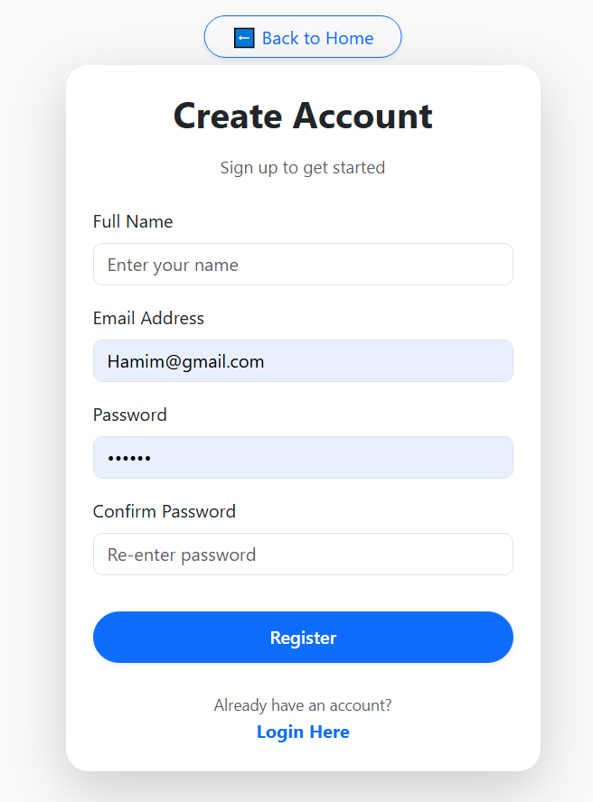
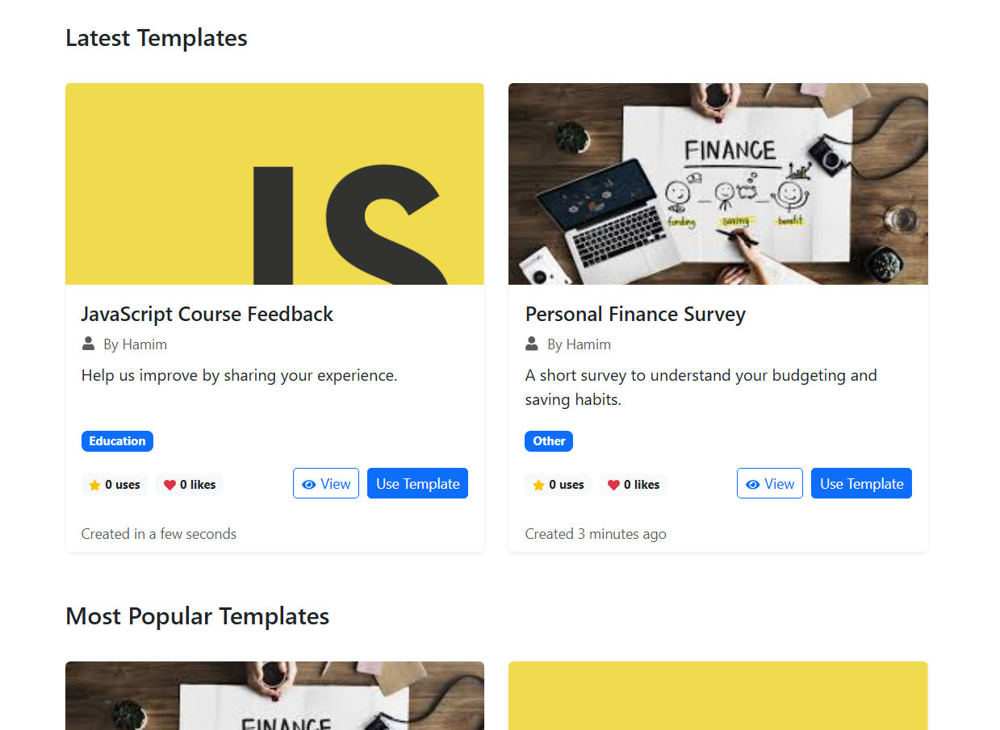
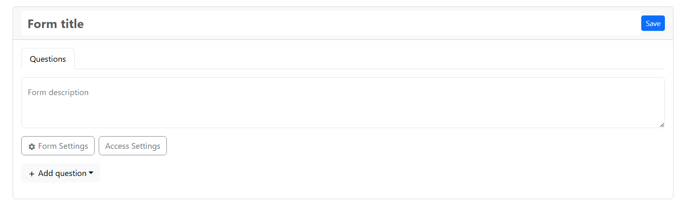
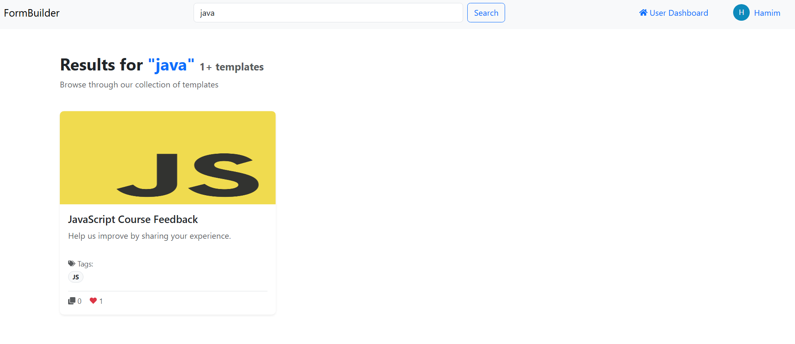

# 📋 Forms Web Application

A full-featured customizable forms web app built with **React**, **TypeScript**, **Bootstrap**, and **Node.js + PostgreSQL (Prisma)**. Inspired by Google Forms, this app allows users to create, share, and analyze quizzes, tests, surveys.

---

## 🔗 Live Demo

👉 [Deployed App Link](https://your-deployment-link.com)

**Supervisor:** *P. Lebedev*

---

## 📌 Features

### ✅ Core Functionality

* 🔐 User Registration and Authentication
* 🎨 Create customizable templates with:

  * Title, description
  * Optional image upload (cloud storage)
  * Tags 
  * Topic category (from DB)
  * Access control (public/private)
  * 📝 Add up to 4 questions per type:
  * Single-line text
  * Multi-line text
  * Positive integers
  * Checkboxes
* 🔄 Drag & drop to reorder questions
* 📥 Users can fill out forms based on templates
* 👍 Likes
* 💬 comments
* 🌍 Full-text search across templates (PostgreSQL)
* 📱  Design with Bootstrap

### 🛠 Admin Panel

* Manage all users: delete, promote/demote admin
* Edit any template

### 💡 User Dashboard

* Manage templates (create/edit/delete)
* Filled forms list

### 📚 Template View

* Tabs:

  * Settings (title, description, image, tags)
  * Questions
  * Responses list
  * Aggregated analysis
  * Comments 
  * Fillable by other users (if access allowed)
  * View other users’ responses (if owner or admin)

---
Here’s a structured `## Screenshots` section for your `README.md`, describing each UI page with bullet points and placeholder image tags (replace with actual image links or relative paths):

---

## 📸 Screenshots

### 🔐 **Login Page**


---

### 📝 **Register Page**



---

### 👤 **Profile Page**


---

### 🏠 **Home Page**



---

### 📄 **Template Page**



---

### 🧾 **Form Fill Page**


---

### 🔍 **Search Results Page**



---

## 🧰 Tech Stack

### Frontend

* React 19 + TypeScript
* Vite
* React Bootstrap
* Bootstrap 5
* React Hook Form
* React Router
* @hello-pangea/dnd (drag & drop)

---

### 🛠 Environment Variables

Create a `.env` file with the following:

```env
VITE_BACKEND_URL=https://formbuilderapp-backend-6.onrender.com
```

---

